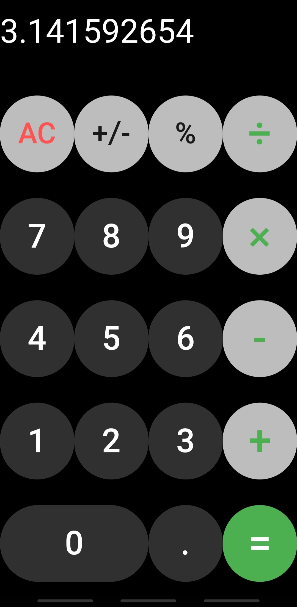
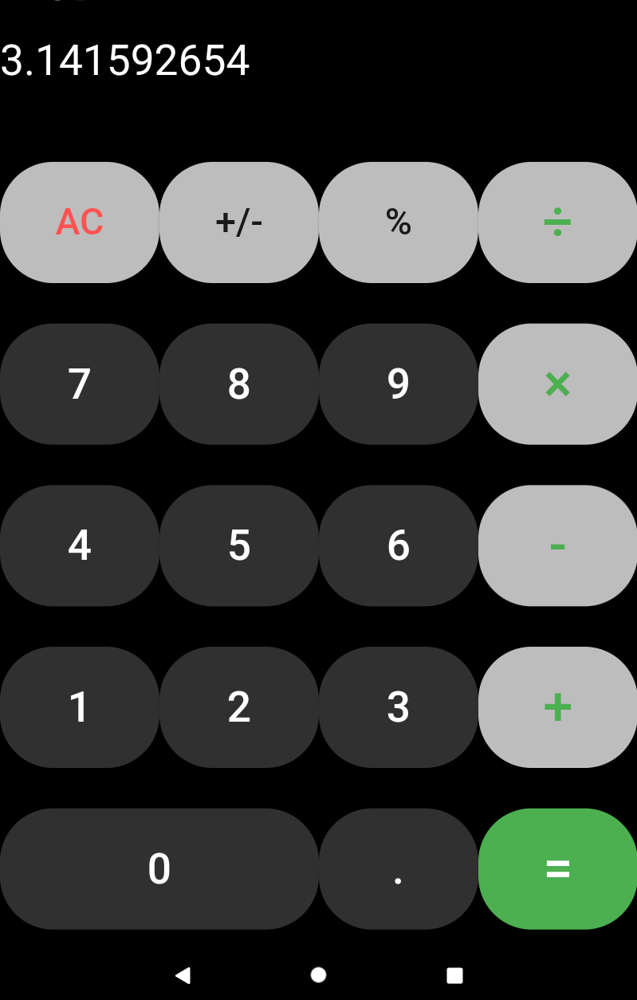
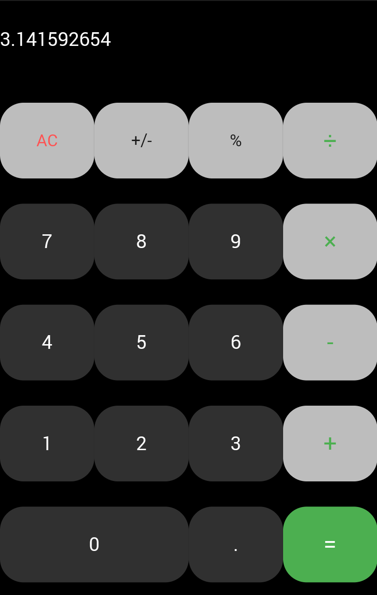

# BasicCalc

A simple, mobile calculator app for summation, subtraction, multiplication, division and working with percentages.
The main purpose of this project was to get started with Flutter by developing a mobile app. The goal was to be able to build this app for IOS and Android with just one code base. The app is currently available in the [Google Play Store](https://play.google.com/store/apps/details?id=com.matze.taschenrechner). Unfortunately, I wasn't able to build a version for the IOS platform.

### Screenshots

##### Smartphone

###### 7.0 inch tablet

###### 9.6 inch tablet

Download Size: 6,87 MB
